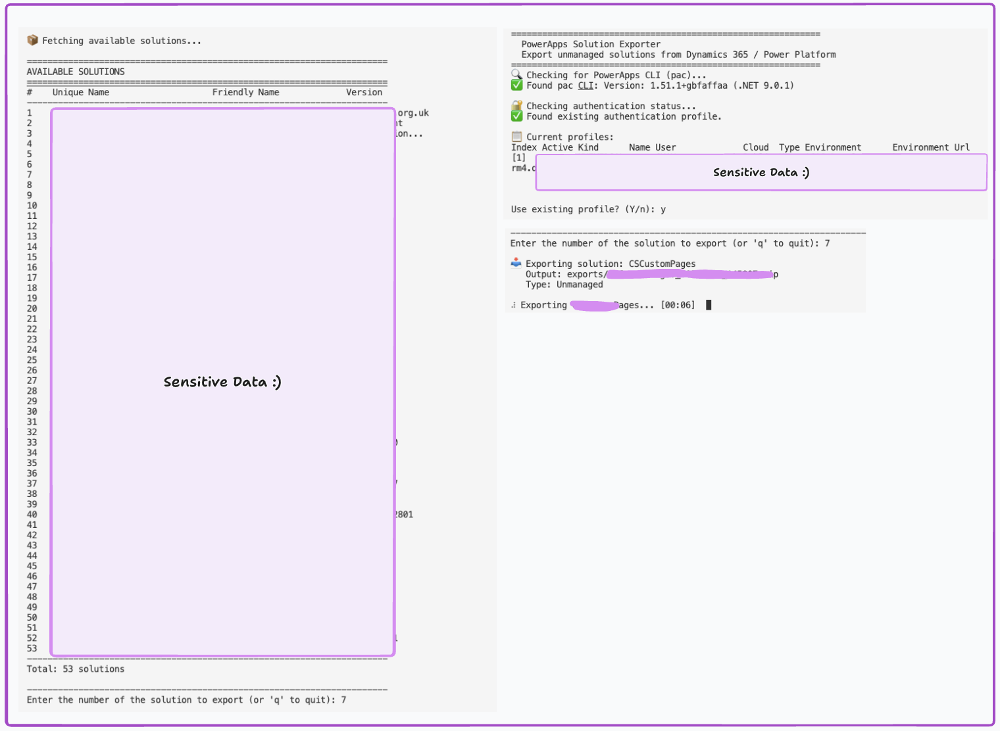

# PowerApps Solution Exporter

[](https://www.python.org/downloads/)
[](https://opensource.org/licenses/MIT)
[](CONTRIBUTING.md)

Its clear that microsofts powerapps solution exporter sucks and is too slow 🥀 , use this instead ❤️



A Python CLI tool to download and export unmanaged PowerApps solutions from Dynamics 365 / Power Platform environments. Perfect for documenting your solutions, creating backups, or setting up CI/CD pipelines.

---

## Table of Contents

- [Quick Start](#quick-start)
- [Features](#features)
- [Prerequisites](#prerequisites)
- [Installation](#installation)
- [Usage](#usage)
- [Managing Authentication](#managing-authentication-profiles)
- [Troubleshooting](#troubleshooting)
- [Contributing](#contributing)
- [License](#license)

---

## Quick Start

```bash
# Add pac to your PATH (run this first if you installed via .NET)
export PATH="$PATH:$HOME/.dotnet/tools"

# Run the exporter
python3 solution_exporter.py
```

To make the PATH change permanent, run:
```bash
echo 'export PATH="$PATH:$HOME/.dotnet/tools"' >> ~/.zprofile && source ~/.zprofile
```

---

## Features

- **Easy Selection** — Numbered list of solutions, just type a number to export
- **Progress Indicator** — Animated spinner with elapsed time during export
- **Multi-Environment Support** — Switch between different Dynamics 365 environments
- **Batch Export** — Export multiple solutions in a single session
- **Automatic Timestamping** — Exported files include timestamps for versioning

---

## Prerequisites

### Python
- Python 3.9 or higher

### PowerApps CLI (pac)

The script requires the PowerApps CLI to be installed. Choose one of the following installation methods:

#### Option 1: Via .NET (Cross-platform)
If you have the .NET SDK installed:
```bash
dotnet tool install --global Microsoft.PowerApps.CLI.Tool
```

> **Important:** After installing via .NET, you must add the tools directory to your PATH!

**macOS/Linux (zsh):**
```bash
# Add to PATH permanently
echo 'export PATH="$PATH:$HOME/.dotnet/tools"' >> ~/.zprofile

# Apply to current session
source ~/.zprofile
```

**macOS/Linux (bash):**
```bash
# Add to PATH permanently
echo 'export PATH="$PATH:$HOME/.dotnet/tools"' >> ~/.bashrc

# Apply to current session
source ~/.bashrc
```

**Windows (PowerShell):**
```powershell
# The installer usually adds this automatically, but if not:
[Environment]::SetEnvironmentVariable("Path", $env:Path + ";$env:USERPROFILE\.dotnet\tools", "User")
```

#### Option 2: Standalone Installer (Windows)
Download and run the installer from:
```
https://aka.ms/PowerAppsCLI
```

#### Option 3: Homebrew (macOS)
```bash
brew tap microsoft/mssql-release
brew install powerapps-cli
```

#### Verify Installation
After installation, restart your terminal and verify:
```bash
pac help
```

---

## Installation

1. **Clone the repository**
   ```bash
   git clone https://github.com/christophergyman/powerapps-solution-exporter.git
   cd powerapps-solution-exporter
   ```

2. **Run the script**
   ```bash
   python3 solution_exporter.py
   ```

No additional Python dependencies required — uses only the standard library.

---

## Usage

### Running the Script

```bash
python solution_exporter.py
```

### First-Time Setup

1. **Authentication**: On first run, you'll be prompted to authenticate:
   - Enter your Dynamics 365 environment URL (e.g., `https://yourorg.crm.dynamics.com`)
   - A browser window will open for you to sign in with your credentials
   - Once authenticated, your profile is saved for future use

2. **Select Solution**: The script displays all available solutions with numbered indices

3. **Export**: Simply enter the number of the solution you want to export (or type the name directly)

### Example Session

```
============================================================
  PowerApps Solution Exporter
  Export unmanaged solutions from Dynamics 365 / Power Platform
============================================================
🔍 Checking for PowerApps CLI (pac)...
✅ Found pac CLI: Version: 1.51.1+gbfaffaa

🔐 Checking authentication status...
✅ Found existing authentication profile.

📦 Fetching available solutions...

======================================================================
AVAILABLE SOLUTIONS
======================================================================
#    Unique Name                    Friendly Name             Version
----------------------------------------------------------------------
1    ContosoCore                    Contoso Core Solution     1.0.0.0
2    ContosoWebResources            Contoso Web Resources     2.1.0.0
3    ContosoComponents              Contoso PCF Components    1.5.0.0
4    ContosoCustomPages             Contoso Custom Pages      3.0.0.0
5    ContosoEntities                Contoso Entities          4.2.0.0
----------------------------------------------------------------------
Total: 5 solutions

----------------------------------------------------------------------
Enter the number of the solution to export (or 'q' to quit): 2

📥 Exporting solution: ContosoWebResources
   Output: ./exports/ContosoWebResources_20241218_143022.zip
   Type: Unmanaged

⠹ Exporting ContosoWebResources... [01:23]

✅ Exporting ContosoWebResources completed in 01:23
   📁 File: exports/ContosoWebResources_20241218_143022.zip
   📊 Size: 2.45 MB
```

---

## Output

Exported solutions are saved to the `./exports/` directory with the naming format:
```
{solution_name}_{YYYYMMDD_HHMMSS}.zip
```

---

## Managing Authentication Profiles

The pac CLI stores authentication profiles that persist between sessions.

| Command | Description |
|---------|-------------|
| `pac auth list` | List all authentication profiles |
| `pac auth create --url <URL>` | Create a new profile |
| `pac auth select --index <N>` | Switch to a different profile |
| `pac auth delete --index <N>` | Delete a profile |
| `pac auth clear` | Remove all profiles |

---

## Troubleshooting

### "pac: command not found"
- Ensure the PowerApps CLI is installed
- Restart your terminal after installation
- **If installed via .NET:** Make sure `~/.dotnet/tools` is in your PATH:
  ```bash
  # Check if pac is there
  ls ~/.dotnet/tools/pac
  
  # Add to PATH for current session
  export PATH="$PATH:$HOME/.dotnet/tools"
  
  # Add permanently (zsh)
  echo 'export PATH="$PATH:$HOME/.dotnet/tools"' >> ~/.zprofile
  ```

### Authentication Fails
- Verify your environment URL is correct
- Ensure you have appropriate permissions in the Power Platform environment
- Try clearing existing auth profiles and re-authenticating:
  ```bash
  pac auth clear
  pac auth create --url https://yourorg.crm.dynamics.com
  ```

### Solution Export Fails
- Verify the solution unique name is correct (case-sensitive)
- Use `pac solution list` to see available solutions
- Ensure you have Solution Export permissions in your environment

### Solution Unique Name vs. Display Name

The script displays solutions with numbered indices, so you can simply enter a number to select. However, if you type a name directly, use the solution's **Unique Name**, not the display/friendly name:
- ✅ Unique Name: `MySolution` 
- ❌ Display Name: `My Custom Solution`

---

## Contributing

Contributions are welcome! Please see [CONTRIBUTING.md](CONTRIBUTING.md) for guidelines.

---

## License

This project is licensed under the MIT License — see the [LICENSE](LICENSE) file for details.
